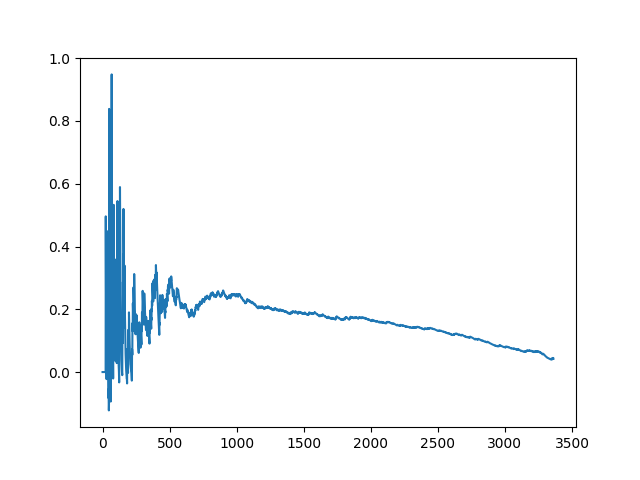

# Time-Decaying Multi Armed Bandit

Overview
========

Non-Stationary 케이스에 적용 할 수 있는 multi armed bandit 알고리즘

Test result
========
### 1. Non-Stationary 케이스

- 실제 로그를 기반으로 해당 알고리즘을 돌려 얻어 낸 결과 값.

### 2. Stationary 케이스
- 실제 값에 아주 작은 오차를 가진 값으로 수렴한다.
- 가령 0.5 가 답인 경우 0.4957821215673 같은 값으로 수렴 하며 신뢰 할 수 있는 오차이다.

Requirements
============

* Python 3.7+ recommended
* Works on Linux, Windows, macOS, BSD

Install
=======

The quick way::

    pip install -r requirements.txt
